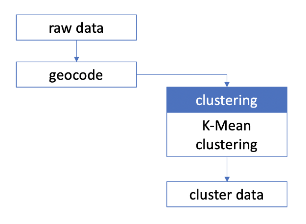

# Build a Clustering Model to Perform a Customer Geolocation Data Clustering with K-Means Algorithm

## Notes
Clone the project on your machine with :

```
git clone https://github.com/zakariamejdoul/neural_style_transfer_pytorch.git
```
## Behaviour
### What is Clustering ?
Clustering is the work to separate population or data points into various categories. Data points are closer to other data points in the same category and distinct from data points in other categories. It’s essentially a collection of objects based on their similarity and difference.
### What type of problem clustering can be solved ?
Clustering algorithms are an effective Machine Learning (ML) technique for unsupervised data (unlabeled data). The most popular algorithms for ML are K-Means clustering. This algorithm is extremely efficient when applied to many ML problems.

The K-Means clustering has been applied to different scenarios in many different problems area, such as:
* Information Technology: used to identify the spam filter, classify network traffic, and identify fraudulent or criminal activity.
* Marketing: used to characterize & discover customer segments for marketing purposes.
* Biology: used for classification among different species of plants and animals.
* Insurance: used to acknowledge the customers, their policies and identifying the frauds.
### Clustering for geolocation data
We are using our customer geolocation data to perform a clustering algorithm to get several clusters in which the member data of each cluster are closest to each other using `KMeans` and `Constrained KMeans` 
which has a parameter to restrict the number’s member of each cluster. We assume each cluster contains the parcel to which the driver should be delivered. So the driver should be travel in a certain closet area only.

This picture showed the flow process when we were dealing with geolocation data. Since we have our customer's address, we need to convert it into latitude and longitude information. We need a few steps to use the [`GeoPandas`](https://geopandas.org/docs/user_guide/geocoding.html) API, which will explain in the `Geocoding` section of the Notebook.



## Steps
The notebook of project is divided on parts that are :
1. Geocoding : From Address to Longitude & Latitude
2. Import Geolocation Data
3. K-Means Model & Training
4. Clustering with Constrained Problem
5. Visualization of the Result

## Results
The result can be shown below :


## Resources
* [Random Point Generator](http://www.geomidpoint.com/random/)
* [Geocoding with GeoPandas](https://geopandas.org/docs/user_guide/geocoding.html)
* [The Clustering Algorithm with Geolocation data](https://medium.com/thelorry-product-tech-data/the-clustering-algorithm-with-geolocation-data-d6dd07ed36a)
## Author
_Zakaria Mejdoul_


<br><br>_Enjoy Clustering and Visualizing your Customers Geolocation Data :exclamation: :rocket:_
